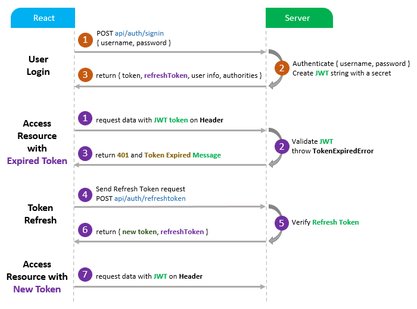

## React Hooks Refresh Token with JWT and Axios Interceptors example



This project was bootstrapped with [Create React App](https://github.com/facebook/create-react-app).

### Set port
.env
```
PORT=8081
```

## Note:
Open `src/services/api.js` and modify `config.headers` for appropriate back-end (found in the tutorial).

```js
instance.interceptors.request.use(
  (config) => {
    const token = TokenService.getLocalAccessToken();
    if (token) {
      // config.headers["Authorization"] = 'Bearer ' + token;  // for Spring Boot back-end
      config.headers["x-access-token"] = token; // for Node.js Express back-end
    }
    return config;
  },
  (error) => {
    return Promise.reject(error);
  }
);
```

### Project setup

In the project directory, you can run:

```
npm install
# or
yarn install
```

or

### Compiles and hot-reloads for development

```
npm start
# or
yarn start
```

Open [http://localhost:8081](http://localhost:8081) to view it in the browser.
